# 📊 Data Diagram - Seat Map Demo Real-time Booking System

## 🗄️ Database Schema & Data Structure


## 🔄 Data Flow Diagram

```mermaid
flowchart TD
    subgraph "📱 Client Data Flow"
        A[User Action] --> B[React Component]
        B --> C[Redux Action]
        C --> D[Redux Store]
        D --> E[useSocket Hook]
        E --> F[Socket.IO Client]
    end
    
    subgraph "🌐 Network Layer"
        F --> G[WebSocket Message]
        G --> H[Socket.IO Server]
    end
    
    subgraph "🖥️ Server Data Processing"
        H --> I[Event Handler]
        I --> J[Data Validation]
        J --> K[Business Logic]
        K --> L[Mock Database]
        L --> M[Data Update]
        M --> N[Broadcast Event]
    end
    
    subgraph "📊 Data Storage"
        L --> O[Seat Map Data]
        L --> P[User Reservations]
        L --> Q[Connection State]
        L --> R[Error Logs]
    end
    
    subgraph "🔄 Real-time Sync"
        N --> S[Broadcast to All Clients]
        S --> T[Client State Update]
        T --> U[UI Re-render]
    end
    
    style A fill:#87CEEB,stroke:#4682B4,stroke-width:2px
    style D fill:#98FB98,stroke:#32CD32,stroke-width:2px
    style H fill:#FFB6C1,stroke:#FF69B4,stroke-width:2px
    style L fill:#F0E68C,stroke:#DAA520,stroke-width:2px
    style S fill:#DDA0DD,stroke:#9370DB,stroke-width:2px
```



## 📋 Data Models & Interfaces

```mermaid
classDiagram
    class SeatMap {
        +string id
        +string name
        +number rows
        +number seatsPerRow
        +Seat[] seats
        +getSeatById(id: string) Seat
        +getAvailableSeats() Seat[]
        +getSelectedSeats() Seat[]
    }
    
    class Seat {
        +string id
        +number row
        +number number
        +string status
        +string userId?
        +string userName?
        +number selectedAt?
        +isAvailable() boolean
        +isSelected() boolean
        +isOccupied() boolean
        +select(userId: string, userName: string) void
        +deselect() void
    }
    
    class User {
        +string id
        +string name
        +string email?
        +number createdAt
        +number lastActive
        +isActive() boolean
        +updateLastActive() void
    }
    
    class Reservation {
        +string id
        +string userId
        +string seatId
        +string status
        +number reservedAt
        +number expiresAt
        +isExpired() boolean
        +extend(duration: number) void
        +cancel() void
    }
    
    class ConnectionState {
        +string status
        +string socketId?
        +number connectedAt?
        +number reconnectAttempts
        +boolean isConnected
        +boolean isReconnecting
        +updateStatus(status: string) void
        +incrementReconnectAttempts() void
        +resetReconnectAttempts() void
    }
    
    class ErrorState {
        +string message
        +string type?
        +number timestamp
        +string requestId?
        +clear() void
        +setError(message: string, type?: string) void
    }
    
    SeatMap ||--o{ Seat : contains
    User ||--o{ Seat : selects
    User ||--o{ Reservation : makes
    Seat ||--o{ Reservation : reserved_in
```

## 🔄 Message Protocol Data Structure

```mermaid
graph TB
    subgraph "📤 Outgoing Messages (Client → Server)"
        A[seat:select] --> A1[SeatSelectRequest]
        B[seat:deselect] --> B1[SeatDeselectRequest]
        C[seats:book] --> C1[SeatBookRequest]
        D[ping] --> D1[PingMessage]
    end
    
    subgraph "📥 Incoming Messages (Server → Client)"
        E[seatMap:data] --> E1[SeatMapData]
        F[seat:updated] --> F1[SeatUpdateNotification]
        G[seats:booked] --> G1[SeatBookConfirmation]
        H[pong] --> H1[PongMessage]
        I[seat:error] --> I1[ErrorResponse]
    end
    
    subgraph "📊 Message Data Structures"
        A1 --> J[SeatSelectRequest]
        B1 --> K[SeatDeselectRequest]
        C1 --> L[SeatBookRequest]
        E1 --> M[SeatMapData]
        F1 --> N[SeatUpdateNotification]
        G1 --> O[SeatBookConfirmation]
        I1 --> P[ErrorResponse]
    end
    
    subgraph "🔧 Data Fields"
        J --> J1[seatId: string<br/>userId: string<br/>userName: string<br/>timestamp: number<br/>requestId: string]
        K --> K1[seatId: string<br/>userId: string<br/>timestamp: number]
        L --> L1[seatIds: string[]<br/>userId: string<br/>userName: string<br/>timestamp: number]
        M --> M1[id: string<br/>name: string<br/>rows: number<br/>seatsPerRow: number<br/>seats: Seat[]]
        N --> N1[seat: Seat<br/>timestamp: number<br/>action: string]
        O --> O1[seats: Seat[]<br/>userId: string<br/>userName: string<br/>bookingId: string]
        P --> P1[message: string<br/>type: string<br/>requestId?: string<br/>alternatives?: Seat[]]
    end
    
    style A fill:#87CEEB,stroke:#4682B4,stroke-width:2px
    style E fill:#98FB98,stroke:#32CD32,stroke-width:2px
    style J fill:#FFB6C1,stroke:#FF69B4,stroke-width:2px
    style M fill:#F0E68C,stroke:#DAA520,stroke-width:2px
```

## 🗂️ State Management Data Flow


## 📈 Performance Data Metrics


## 🔄 Real-time Data Synchronization

```mermaid
sequenceDiagram
    participant U1 as User 1
    participant C1 as Client 1
    participant S as Server
    participant C2 as Client 2
    participant U2 as User 2
    
    Note over U1,U2: 🎬 Real-time Seat Selection Data Flow
    
    U1->>C1: Click seat-17
    C1->>C1: Update local state (optimistic)
    C1->>S: emit('seat:select', {seatId: 'seat-17', userId: 'user-1', userName: 'John'})
    
    S->>S: Validate seat availability
    S->>S: Update seat status to 'selected'
    S->>S: Store reservation data
    
    S->>C1: emit('seat:updated', updatedSeat)
    S->>C2: emit('seat:updated', updatedSeat)
    
    C1->>C1: Confirm local state update
    C2->>C2: Update seat-17 to 'selected'
    
    C1->>U1: Show seat as selected
    C2->>U2: Show seat-17 as unavailable
    
    Note over U1,U2: 🔄 Data Consistency Maintained
    
    U2->>C2: Try to select seat-17
    C2->>S: emit('seat:select', {seatId: 'seat-17', userId: 'user-2', userName: 'Jane'})
    
    S->>S: Check seat status (already selected)
    S->>C2: emit('seat:error', {message: 'Seat not available'})
    
    C2->>U2: Show error message
```



## 🗃️ Data Persistence Strategy


## 🎯 Data Quality & Validation


---

## 📋 Data Diagram Summary

### 🎯 **Core Data Entities:**
- **SeatMap**: Theater configuration (rows, seats per row)
- **Seat**: Individual seat with status and user assignment
- **User**: User information and session data
- **Reservation**: Temporary seat holds with expiry
- **Booking**: Confirmed seat purchases
- **ConnectionLog**: WebSocket connection tracking

### 🔄 **Data Flow Patterns:**
- **Optimistic Updates**: Client updates immediately, server validates
- **Real-time Sync**: All clients receive updates via WebSocket
- **Conflict Resolution**: Server handles concurrent seat selections
- **State Persistence**: Redux store with local storage backup

### 📊 **Performance Characteristics:**
- **Message Latency**: < 100ms for real-time updates
- **State Consistency**: Guaranteed across all connected clients
- **Data Validation**: Type-safe with runtime validation
- **Error Handling**: Graceful degradation with user feedback

### 🛡️ **Data Security & Integrity:**
- **Input Validation**: All user inputs validated server-side
- **State Authorization**: Users can only modify their own selections
- **Audit Trail**: All actions logged for debugging
- **Error Recovery**: Automatic state restoration on failures

*Data Diagram này thể hiện cấu trúc dữ liệu hoàn chỉnh của Seat Map Demo system, từ database schema đến real-time data synchronization, đảm bảo data consistency và performance optimization.*
